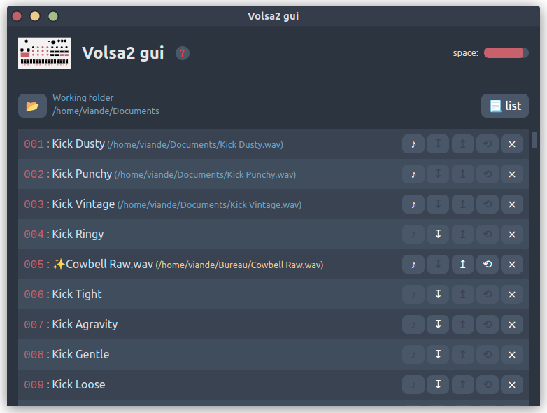

<div align="center"> 

# Volsa2 gui
  

A simple app for managing Volca Sample 2 files on linux
</div>

## About

⚠️ The app is build on top [VolSa 2](https://github.com/00nktk/volsa2) and will NOT work if you don't install it correctly, **Volsa2 gui** assumes `volsa2-cli` is reachable at `/home/$USER/.cargo/bin/`

protip: install `volsa2-cli` with cargo, it's easier.

This app is "linux only", it may compiles on windows and macos but as it uses **VolSa 2**, you can't do anything with it from window or macos.

The app uses `aplay` command from `alsa` to play sounds. It's not mandatory but necessary if you want to hear your samples from within the app.

Feel free to submit pull requests or suggestions. Be warned, the code is a ~~total mess~~ (not anymore) personnal project.

## Usage

1. Power up and USB plug your **Volca Sample 2**
2. Launch the app
3. Click "📃 list" button to get *Volca* samples list
4. Click "📂 folder" button to select a *working directory*
5. Click an item "↧ download" button to save sound from *Volca* to *working directory*
6. Drag one or multiples *wav* files from your desktop on *slots*
7. Click the "⟲ revert" button for reverting your changes
8. Click the "♪ play" button to listen to the downloaded or new dragged sample
9. Click the "↥ upload" button to upload sample to *volca*
10. Click the "⨯ remove" button to empty a slot on the *volca*

Don't try to upload some weird things as PDF files or PNG... Use it at your own risk !

## Todos
### v0.0.1
- [x] Clean...
- [x] eslint, editorconfig, prettier
- [x] Pinia / store for list state 
- [x] Samples ~~size~~ and duration

### v1.0.0
- [ ] Settings  
- [ ] Save last folder
- [ ] .desktop file for deb installation
- [ ] Release Deb / AppImage / ~~snap~~
- [ ] Test files format
- [ ] Add mid/left/right/side option

### v2.0.0
- [ ] Bulk upload
- [ ] Bulk download
- [ ] Comments


## Developers starting guide
The app is based on this template : [electron-vue-template](git@github.com:Turbnok/volsa2gui.git). So you can check for more informations.

Clone this repository: `git clone git@github.com:Turbnok/volsa2gui.git`

### Install dependencies ⏬

```bash
nvm use 
npm install
```

### Start developing ⚒️

```bash
npm run dev
```

## Developers tools (Visual Studio Code extensions)

1. Prettier - Code formatter [(esbenp.prettier-vscode)](https://marketplace.visualstudio.com/items?itemName=esbenp.prettier-vscode)
   
2. EditorConfig  for VS Code [(EditorConfig.EditorConfig)](https://marketplace.visualstudio.com/items?itemName=esbenp.prettier-vscode)
3. ESlint [(dbaeumer.vscode-eslint)](https://marketplace.visualstudio.com/items?itemName=dbaeumer.vscode-eslint)
4. Vue Language Features (Volar) [(Vue.volar)](https://marketplace.visualstudio.com/items?itemName=Vue.volar)
5. TypeScript Vue Plugin (Volar) [(Vue.vscode-typescript-vue-plugin)](https://marketplace.visualstudio.com/items?itemName=Vue.vscode-typescript-vue-plugin)

No need of a .vscode/settings.json
